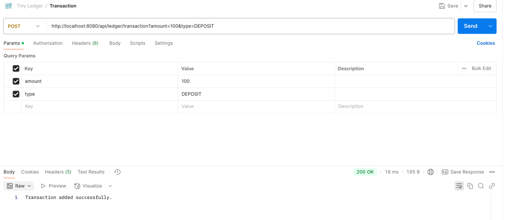
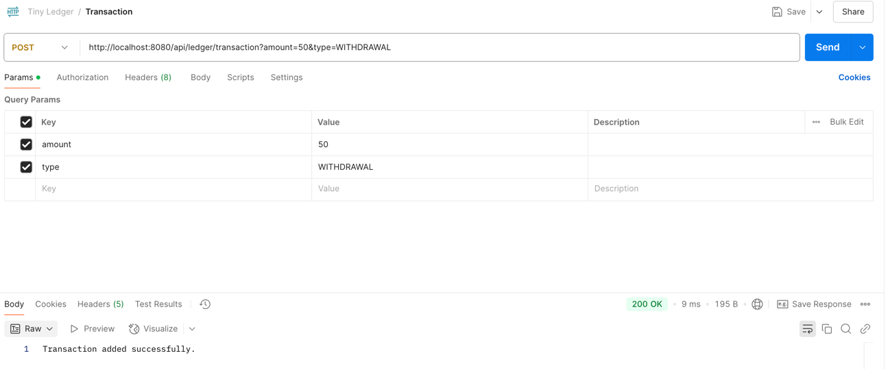
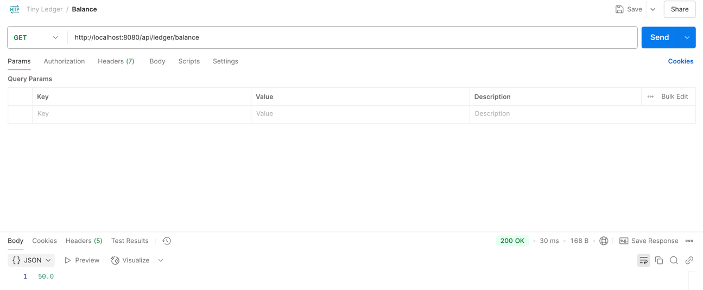
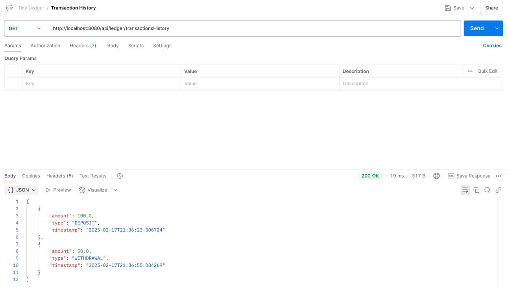
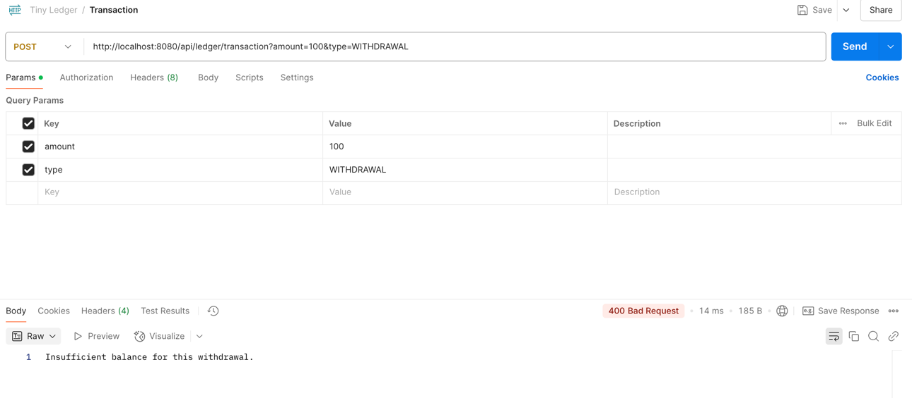

# Tiny Ledger Application

This is a Spring Boot application that provides APIs for a tiny ledger system. It allows users to deposit funds, withdraw funds, get their current balance, and view their transaction history. 
This project demonstrates foundational concepts of backend development, including service-oriented architecture, unit testing, and API documentation.

### Features

- Record and track deposits and withdrawals.
- View account balance.
- Retrieve the entire transaction history.
- Basic error handling for insufficient balance.
- Swagger/OpenAPI documentation for easy API exploration.
- Dockerized for quick container-based deployment.
- Postman collection to test endpoints.

## Getting Started

### Prerequisites

- Java 17+
- Maven 3.8+
- Docker (optional, for containerized deployment)

### How to Run Locally

1. Clone the repository:

   ```bash
   git clone https://github.com/pedromgsilva95/TinyLedger.git
   cd ledger
   ```

2. Build the project using Maven:

   ```bash
   mvn clean install
   ```

3. Run the application:

   ```bash
   mvn spring-boot:run
   ```

4. Alternatively, you can run using Docker:

   ```bash
   docker build -t tiny-ledger .
   docker run -p 8080:8080 tiny-ledger
   ```

### API Documentation

Once the application is running, the APIs can be accessed and explored through Swagger UI:

- **Swagger UI**: [http://localhost:8080/swagger-ui.html](http://localhost:8080/swagger-ui.html)
- **OpenAPI JSON**: [http://localhost:8080/v3/api-docs](http://localhost:8080/v3/api-docs)


## Design and Architecture

### 1. Data Structures

- The application uses an in-memory `ArrayList` to store transactions.
- Each `Transaction` object is immutable and contains a timestamp, a type (DEPOSIT or WITHDRAWAL), and an amount.

### 2. APIs

- **POST /transaction**: Record a new transaction (deposit or withdrawal).
- **GET /balance**: Retrieve the current balance.
- **GET /transactions**: Retrieve the transaction history.
- **Validation**: Withdrawals that exceed the current balance are not allowed and will throw an `InsufficientBalanceException`.

### 3. Error Handling

- Basic exception handling for invalid operations (e.g., insufficient balance).
- Custom exceptions are used to return meaningful error messages.

### 4. Dockerization

- A `Dockerfile` is included for building and running the application in a containerized environment.

### 5. Trade-offs

- **No Persistence**: For simplicity, all data is stored in memory. No database is used.
- **No Concurrency Handling**: Assumes single-threaded execution. Concurrency would need to be handled for a production-grade system.

## Testing

The project includes unit tests under `src/test/java/com/tiny/ledger`:

- **LedgerServiceTest**: Tests the core business logic, including deposit, withdrawal, insufficient balance handling, and transaction history retrieval.
- **LedgerControllerTests**: Tests the API endpoints for expected responses and behavior.

Run the tests using Maven:

```bash
mvn test
```

## How to use

1. Example of how to make a deposit:


2. Example of how to make a withdrawal:


3. Example of how to view current balance:


4. Example of how to view transactions history:


5. Example of error when amount do withdrawal is bigger than current balance:



Thank you for exploring the Tiny Ledger Application!
